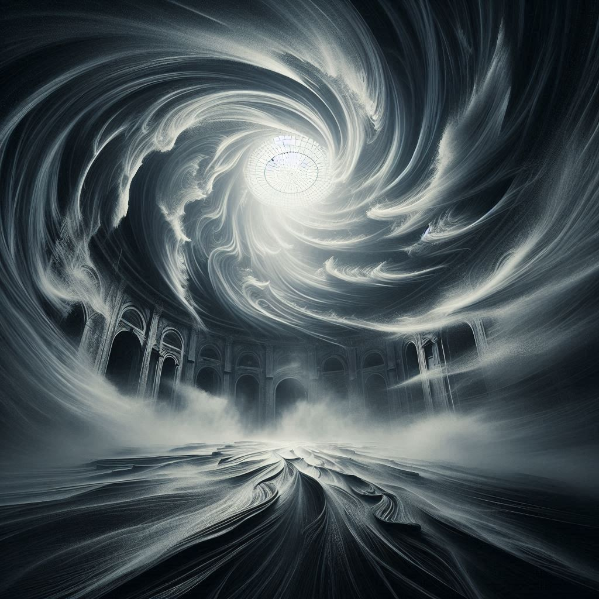

# La Salle de la Tempête

Une salle tourbillonnante, remplie de vents et d'échos de tempête. Les murs vibrent avec la puissance de la nature, et il est difficile de rester debout.

Vous pouvez aller vers :
- [La Salle du Temps](salle10.md)
- [La Salle des Échos](salle12.md)

**Objet** : Une pierre de tempête qui peut contrôler le vent.
