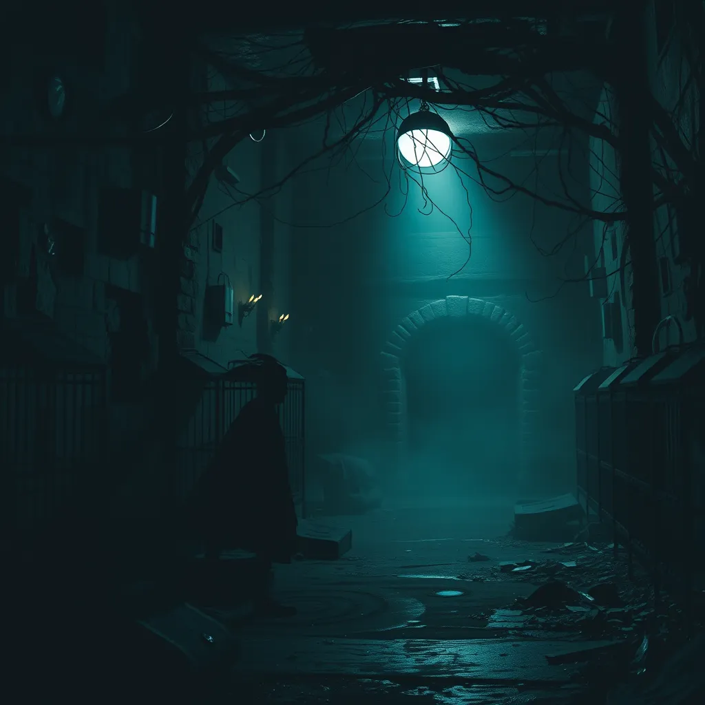

# L'Antre des Monstres

Une pièce sombre remplie de bruits étranges. Des ombres se déplacent, et vous sentez une présence menaçante. Des cages vides indiquent que les créatures étaient autrefois enfermées ici.

Vous pouvez aller vers :
- [Le Hall des Secrets](salle2.md)
- [La Plateforme des Veilleurs](salle4.md)
- [La Salle de la Fuite](salle5.md)

**Objet** : Une clé rouillée, qui semble ouvrir un passage secret.

