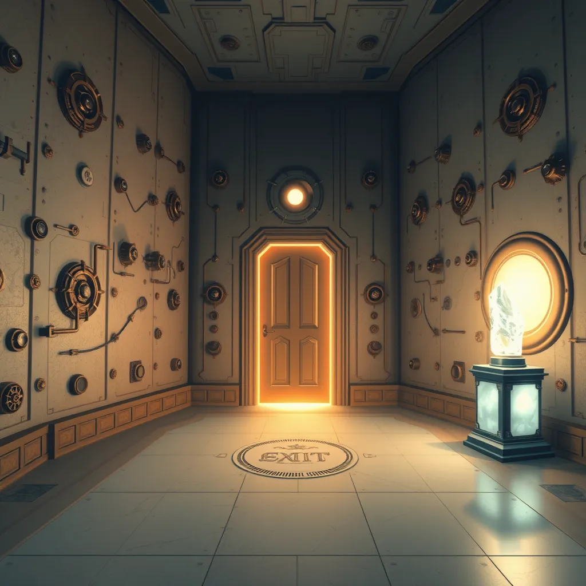

# La Salle de la Fuite

Une salle finale, où vous devez résoudre une dernière énigme pour ouvrir la porte de sortie. Les murs sont couverts de mécanismes complexes.

**Objet trouvé** : Un cristal brillant, qui pourrait déverrouiller la porte de sortie.

Vous pouvez aller vers :
- [L'Antre des Monstres](salle3.md)
- [La Plateforme des Veilleurs](salle4.md)
- [La Salle de l'Obscurité](salle6.md)

Salle créé par : **Boutiara Abdelhak**
