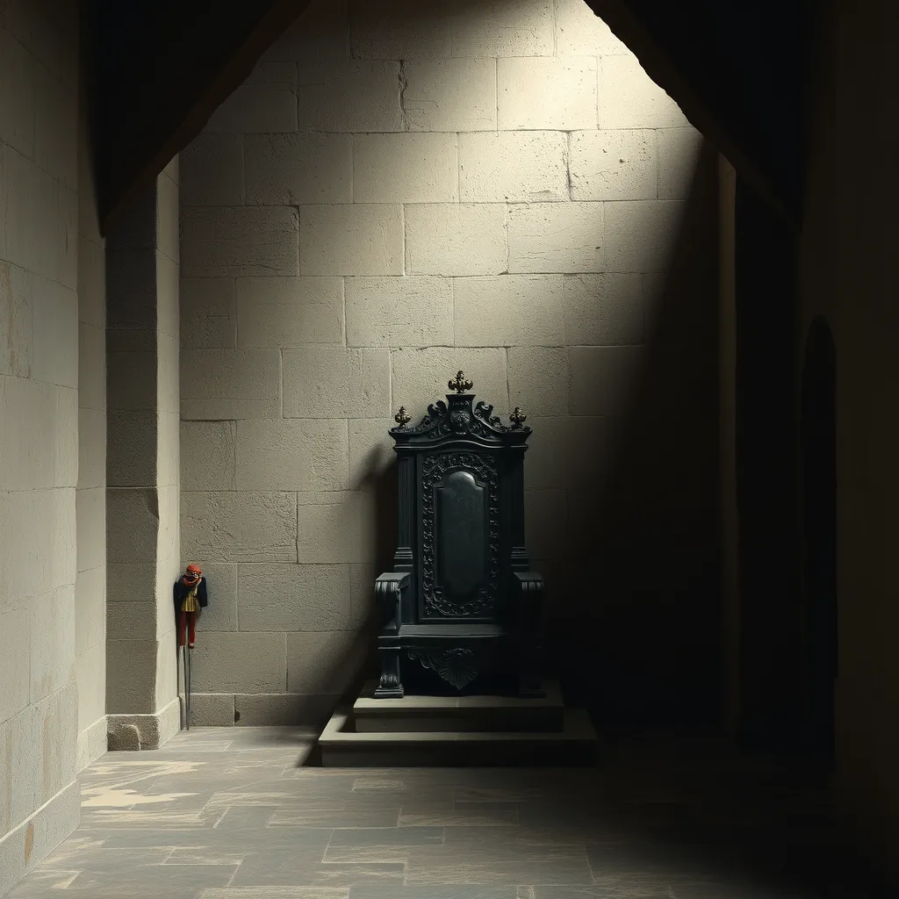

# La cachette du Médaillon

Une pièce cachée derrière un mur secret, accessible uniquement grâce au médaillon trouvé dans le Hall des Secrets. L'air est lourd de mystère, et un trône ancien trône au centre.

Vous pouvez aller vers :
- [La Chambre de l'Éveil](index.md)

**Objet** : Un trésor ancien qui pourrait changer votre destin.

créée par : LOUNAS Gana
